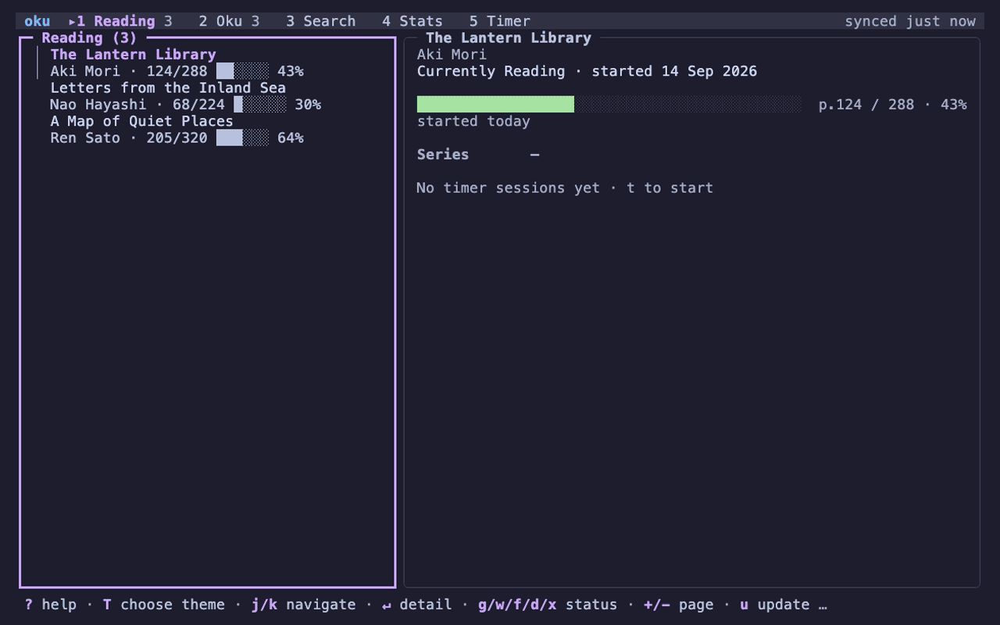

# Oku

[](https://github.com/Kameleon21/oku/graphs/contributors)

Terminal companion for [Hardcover](https://hardcover.app): browse your shelves, search books, and track reading — all without leaving the terminal.



## Features

- Full TUI dashboard with vim-style navigation (`h/j/k/l`)
- CLI for scripting and quick actions
- Search by book, author, or genre
- Reading stats pulled from Hardcover: yearly summary, goal progress, activity heatmap, ratings and genre breakdowns
- Reading timer to log sessions
- Local SQLite cache with auto-refresh

## Install

macOS (Homebrew cask):

```bash
brew tap Kameleon21/oku
brew install --cask oku
```

Linux / Windows:

- Download a prebuilt binary from [GitHub Releases](https://github.com/Kameleon21/oku/releases/latest).
- Or install from source with Go:

```bash
go install github.com/Kameleon21/oku/cmd/oku@latest
```

Development branch (latest features):

```bash
go install github.com/Kameleon21/oku/cmd/oku@develop
```

## Getting Started

Oku connects to [Hardcover](https://hardcover.app), a book tracking platform. You'll need a free account and an API token.

1. Create a free account at [hardcover.app](https://hardcover.app)
2. Go to [Account Settings](https://hardcover.app/account/api) to find your API token
3. Run the setup:

```bash
# Save your Hardcover API token
oku auth set-token

# Pull your library to local cache
oku sync

# Launch the TUI
oku
```

Your token is stored in the system keychain. You can also set `HARDCOVER_TOKEN` as an environment variable.

## Usage

```text
oku                    Launch TUI dashboard
oku tui                Launch TUI dashboard

oku search <query>     Search books (--mode book|author|genre)
oku now                Show current read
oku reading            Show reading list
oku update --page <N>  Update page progress
oku stats              Show reading stats and activity heatmap

oku sync               Refresh all cached data
oku auth set-token     Set API token
oku config show        Show configuration
```

Use `--json` for JSON output and `--view compact|default|verbose` to control detail level.

## TUI Navigation

Oku uses vim-style keybindings throughout. Arrow keys also work.

| Key     | Action                 |
| ------- | ---------------------- |
| `h/l`   | Move between panes     |
| `j/k`   | Navigate lists         |
| `/`     | Search                 |
| `Enter` | Open details           |
| `+/-`   | Quick page update      |
| `U`     | Undo the last change   |
| `?`     | Help                   |
| `q`     | Quit                   |

Status changes and page updates show a toast for a few seconds; press `U` while it is up to put the book back where it was. Press `?` for every key the focused section understands.

## Config

Config lives at `~/.config/oku/config.toml`:

```toml
editor = "nvim"
use_fzf = false
default_list = "reading"
theme = "auto" # auto | dark | light
```

The TUI and the coloured CLI output adapt their palette to a light or dark terminal on their own. Set `theme` when your terminal does not report its background (or reports it wrongly); it applies to every command. `NO_COLOR` is honoured: focus is also shown by a thick border and a `▸` marker, not by colour alone.

## Development

```bash
go test ./...
go build ./cmd/oku
```

### Branch and release flow

Feature branches are opened as pull requests into `develop` (CI runs `go test ./...` on every PR). `Master` is the release branch and keeps the released history.

To release:

```bash
git checkout Master
git pull origin Master
git merge origin/develop
go test ./...
goreleaser release --snapshot --clean
git tag vX.Y.Z
git push origin Master
git push origin vX.Y.Z
```

Pushing a `v*` tag runs the GoReleaser workflow, publishes the GitHub release, and updates the Homebrew cask.

## Contributors

[](https://github.com/Kameleon21/oku/graphs/contributors)
